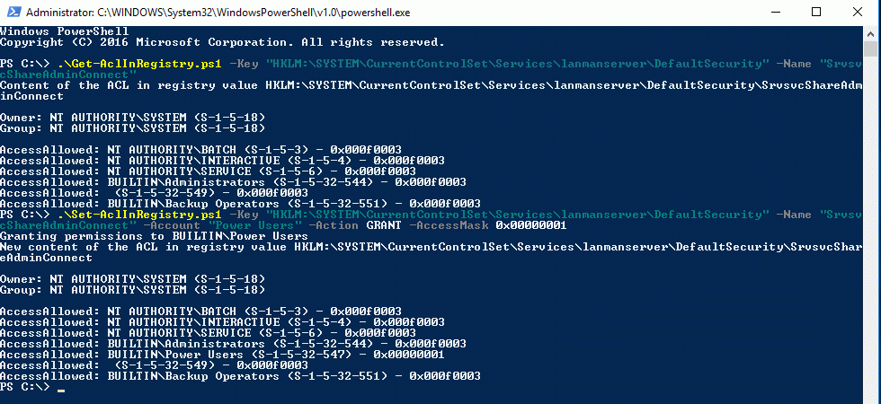

# Powershell: Permissions for administrative shares (like ADMIN$) / registry ACLs
Powershell scripts to get or set permissions for administrative shares and other registry stored ACLs like permissions for the server service, for shares, for Remote Desktop connections and for the access to services or DCOM applications.

Since Technet Gallery will be closed, now here.

See Script Center version: [Powershell: Permissions for administrative shares (like ADMIN$) / registry ACLs](https://gallery.technet.microsoft.com/scriptcenter/Powershell-permissions-for-53d0c8ce).

## Description
Powershell scripts to get or set permissions for administrative shares (like C$ oder ADMIN$) and other registry stored ACLs like permissions for the server service, for shares, for Remote Desktop connections and for the access to services or DCOM applications.

Some permissions are stored in ACLs in binary values in the registry. Since they are not human readable, I developed two scripts to show or modify these ACLs.

While the permissions are modified directly in the registry, the responsible service usually does not notice the change and has to be restarted (or the computer has to be restarted).

## Usage
Assuming the scripts are in the current directory, the command

```powershell
.\Get-AclInRegistry.ps1 -Key "HKLM:\SYSTEM\CurrentControlSet\Services\lanmanserver\DefaultSecurity" -Name "SrvsvcShareAdminConnect"
```
shows the permissions for the administrative shares ADMIN$, C$ ...

The permissions for the administrative shares are modified with a command like this:
```powershell
.\Set-AclInRegistry.ps1 -Key "HKLM:\SYSTEM\CurrentControlSet\Services\lanmanserver\DefaultSecurity" -Name "SrvsvcShareAdminConnect" -Account "Power Users" -Action GRANT -AccessMask 0x00000001
```

After a restart of the lanmanserver service (e.g. with Restart-Service Lanmanserver -Force) members of the "Power Users" group can access the administrative shares.

(Please see "Access masks.txt" for further remarks)



## Examples
For investigating a remote computer REMOTE and the last three reboot times you call
```powershell
# Show permissions for the share "MyShare"
.\Get-AclInRegistry.ps1 "HKLM:\SYSTEM\CurrentControlSet\Services\lanmanserver\Shares\Security" "MyShare"

# Modify default permissions for Remote Desktop connections
# (The change applies to all future Remote Desktop connections, not to existing)
.\Set-AclInRegistry.ps1 "HKLM:\SYSTEM\CurrentControlSet\Control\Terminal Server\WinStations" "DefaultSecurity" "DOMAIN\GROUP" SET 0x00000121

# Modify permissions for the control of the BITS service. The change applies after restart of the computer.
.\Set-AclInRegistry.ps1 "HKEY_LOCAL_MACHINE\SYSTEM\CurrentControlSet\services\BITS\Security" Security "nt authority\interactive" "revoke" 0x0002018d

# Show the launch security of the DCOM application "PrintNotify" of Windows 10.
.\Get-AclInRegistry.ps1 "HKEY_LOCAL_MACHINE\SOFTWARE\Classes\AppID\{588E10FA-0618-48A1-BE2F-0AD93E899FCC}" "LaunchPermission"
```
Some important values for access masks are explained in file "Access masks.txt"
