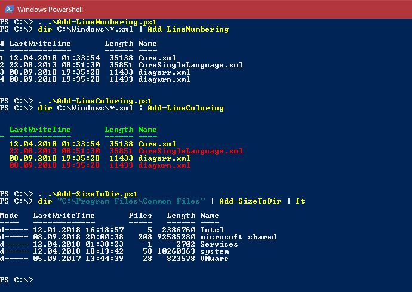

# Powershell: add line numbering, line coloring, directory size to output/pipeline
Some fun powershell scripts to add additional information to your output or objects in the pipeline. 

Add-LineNumbering adds line numbering, Add-LineColoring adds alternating line colors and Add-SizeToDir adds file count and length.

Since Technet Gallery is closed, now here.

See Script Center version: [Powershell: add line numbering, line coloring, directory size to output/pipeline](https://gallery.technet.microsoft.com/scriptcenter/Powershell-add-line-cd0e4acf).

## Description
Here are some fun powershell scripts to add additional information to your output or objects in the pipeline

### Add-LineNumbering
Adds a new column to output or object in the pipeline with an incrementing line number

### Add-LineColoring
Adds alternating line colors to output or object in the pipeline. Requires an "ANSI escape sequence"-capable output device.

### Add-SizeToDir
Adds file count and length to file system directory objects in output or objects in the pipeline (might take some time to evaluate).

See effect here:



And here is how to use (assume the PS1 files are in the current directory, they are intended to be imported in your profile)

## Add-LineNumbering
```powershell
. .\Add-LineNumbering.ps1 
 
dir C:\Windows\*.xml | Add-LineNumbering
```

Adds a numbering property / column to objects. The default output properties get extended by this column if they exist.

```
Parameters:
-InputObject  Object to be expanded. Can be handed through the pipeline.
-StartNumber  Numbering start number
-Step  Numbering increment
```

## Add-LineColoring
```powershell
. .\Add-LineColoring.ps1 
 
dir C:\Windows\*.xml | Add-LineColoring
```

Adds a property / column with a changing color to objects. The coloring can only be seen when outputting the object to an ANSI escape sequence-capable output device. The standard output properties are extended by this column if they exist.

```
Parameters:
-InputObject  Object to be expanded. Can be handed through the pipeline.
-OddColor  Color for odd line numbers
-EvenColor  Color for even line numbers
-TitleColor  Color for title bar
```

## Add-SizeToDir
```powershell
. .\Add-SizeToDir.ps1 

dir "C:\Program Files\Common Files" | Add-SizeToDir | ft
```

Adds file count and length properties with the total count and total size of the contained files to file system directory objects. The output may take a long time depending on the depth of recursion. Non file system directory objects remain unchanged.

```
Parameters:
-InputObject  Object to be expanded. Can be handed through the pipeline.
```
