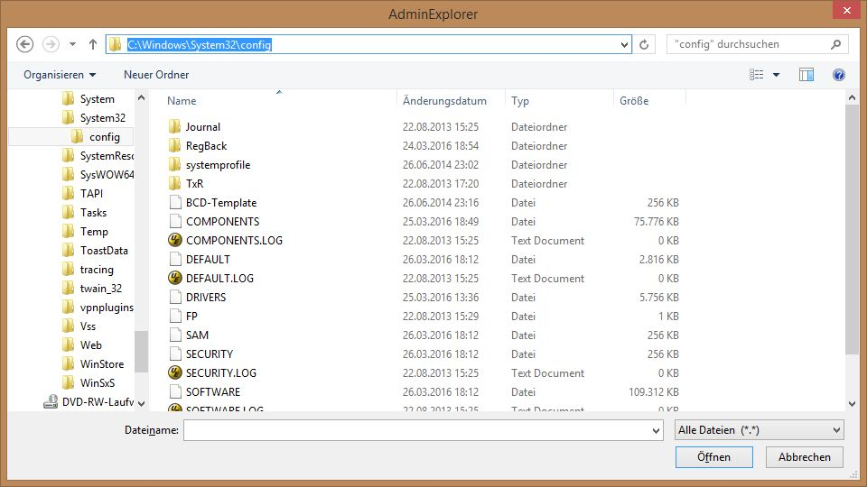

# "File Open" Dialog As Replacement for An Adminstrative Windows Explorer
Since Windows Explorer cannot be started with administrative privileges starting with Windows 7, this script starts an administrative "File Open" dialog as a replacement.

Since Technet Gallery will be closed, now here.

See Script Center version: ["File Open" Dialog As Replacement for An Adminstrative Windows Explorer](https://gallery.technet.microsoft.com/scriptcenter/Powershell-permissions-for-53d0c8ce).

Now also on Powershell Gallery as part of the **SysAdminsFriends** module, see [here](https://www.powershellgallery.com/packages/SysAdminsFriends/) or install with
```powershell
Install-Module SysAdminsFriends
```

Project page on github is [here](https://github.com/MScholtes/SysAdminsFriends).

## Description
Starting with Windows 7 it is not possible to run Windows Explorer with administrative privileges, When you try to open a file oder folder that require those privileges, after asking whether you really want that access Windows Explorer changes the ACL of this file or folder! You will get access rights on that file, but those access rights will not be taken away after Windows Explorer is closed.

I think this is not only disturbing, changing the ACLs without taking the changes back is a security risk,

So I built a powershell function that calls the well known solution: the file open dialog (some start an "adminstrative notepad" to get that dialog).

## Usage
The following call (after dot sourcing with **". .\Admin-Explorer.ps1"** - assuming the script is in the current directory):

```powershell
AdminExplorer "C:\Windows\System32\config"
```
starts (depending on your UAC settings after a confirmation) the file open dialog shown in the screenshot.

In this dialog you can do what you can do in Windows Explorer (copy, paste, create new folder, delete...), but you do have administrative rights. Whether you close the dialog with cancel or a selected file is of no meaning, the return value is not evaluated. But: no ACLs of files or folders are changed!

Requirement: The admin account needs access right to **Admin-Explorer.ps1**, because a new instance of powershell has to be started when powershell is not in administrative mode already.



If you intend to use this function more often, I recommend to put the function in your powershell profile (use **Admin-Explorer-profile.ps1** for this).

Other functions defined in Admin-Explorer.ps1 are:

**Select-FileDialog** (starts a "File Open" or "Save As" dialogue)

Example:
```powershell
$file = Select-FileDialog -Title "Select a file" -Directory "C:\Users" -Filter "Powershell Scripts|*.ps1"
```

**Test-Admin** (checks whether the current Powershell runs in administrative mode)

Example:
```powershell
Test-Admin
```

**Start-Elevated** (starts a program with administrative privileges)

**su** (alias for Start-Elevated)

**sudo** (alias for Start-Elevated)

Example:
```powershell
Start-Elevated "cmd.exe" "/c pause"
```

**Start-ElevatedPowerShell** (starts an administrative powershell)

Example:
```powershell
Start-ElevatedPowerShell "cd 'C:\Program Files';","ls"
```
