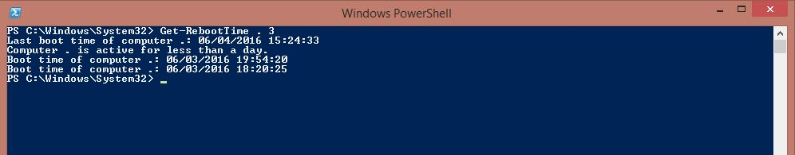

# Retrieve latest reboot time(s)
Short script to retrieve the latest reboot time(s) of a computer

Since Technet Gallery is closed, now here.

See Script Center version: [Retrieve latest reboot time(s)](https://gallery.technet.microsoft.com/scriptcenter/Retrieve-latest-reboot-97ab5270).

Now also on Powershell Gallery as part of the **SysAdminsFriends** module, see [here](https://www.powershellgallery.com/packages/SysAdminsFriends/) or install with
```powershell
Install-Module SysAdminsFriends
```

Project page on github is [here](https://github.com/MScholtes/SysAdminsFriends).

## Description
This is a little helper script that is very useful in a work as system administrator:

In an enterprise you often have to log on to "unknown" servers that behave strangely. Getting the latest reboot time(s) is a very important information for further diagnosis (a well managed server normally reboots only once in a month on Microsoft Patch Day).

## Usage
in the following examples I assume Get-RebootTime.ps1 is in the current directory

To use it just dot source the script Get-RebootTime.ps1 per instance by
```powershell
. .\Get-RebootTime.ps1
```

You can than get the latest reboot time of the local computer with
```powershell
Get-RebootTime
```

For investigating a remote computer REMOTE and the last three reboot times you call
```powershell
Get-RebootTime REMOTE 3
```
A dot can be used for the name of the local computer.

You will get a similiar output to this (screenshot is not from a bad managed server, but my personal computer):


