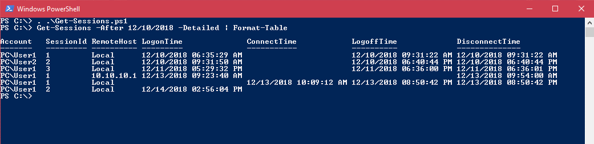

# Get-Sessions: Powershell script for information on interactive logins (incl RDP)
Useful when the order displayed in a GridView (with Out-GridView) or in a CSV fileGet-Sessions: Powershell script to get information about interactive logins (including RDP sessions) including logon, connect, disconnect and logoff times. Session ID and remote host for RDP can be requested per parameter.

Since Technet Gallery will be closed, now here.

See Script Center version: [Get-Sessions: Powershell script for information on interactive logins (incl RDP)](https://gallery.technet.microsoft.com/Get-Sessions-Powershell-1dcf779d).

Now also on Powershell Gallery as part of the **SysAdminsFriends** module, see [here](https://www.powershellgallery.com/packages/SysAdminsFriends/) or install with
```powershell
Install-Module SysAdminsFriends
```

Project page on github is [here](https://github.com/MScholtes/SysAdminsFriends).

## Description
The script Get-Sessions gets information about interactive logins to a system (including RDP sessions).

If no further parameters are specified, the local system is examined and the logins of the last week are displayed in short format. An attempt is made to logically summarize the times of logon sessions, this means for a new connection after a disconnect a new output line is displayed.

If parameter -Detailed is specified, the output will be expanded with session id and name or IP of the remote host.

Based upon the script Get-ULogged.ps1 from [VGSandz](https://gallery.technet.microsoft.com/scriptcenter/Find-Users-who-Logged-in-07dbe5f6).



## Examples
assuming Get-Sessions.ps1 is in the current directory

Get logon information for the days 01/03 and 01/04/2019 including session id and remote host:
```powershell
. .\Get-Sessions.ps1
Get-Sessions -After 01/03/2019 -Before 01/05/2019 -Detailed | Format-Table
```

Get logon information for the last week for user Administrator on remote system REMOTESYSTEM:
```powershell
. .\Get-Sessions.ps1 
Get-Sessions -Computer REMOTESYSTEM -User Administrator
```
