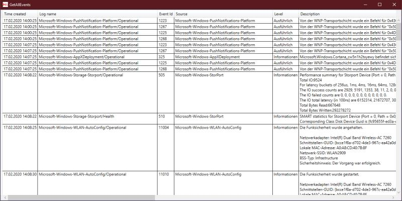

# GetAllEvents: Query all events from all event logs
Command line tool to query all events from all event logs (about 1200 in Windows 10) and display in GridView or export to text or csv file.

Since Technet Gallery will be closed, now here.

See Script Center version: [GetAllEvents: Query all events from all event logs](https://gallery.technet.microsoft.com/scriptcenter/GetAllEvents-Query-all-d0a40b20).

## Description
Command line tool to query all events from all event logs (about 1200 in Windows 10) and display in GridView or export to text or csv file. A remote computer can be accessed.

Requires .Net 4.x



**GetAllEventsCLI.exe** is a included version for systems without graphical (WPF) support because on systems without *Desktop Experience* installed the *"WPF version"* crashes.

The version **GetAllEvents.Net3.5.exe** is .Net 3.5 version that lacks grid view and credential support.

Source code is available here: (https://github.com/MScholtes/GetAllEvents)

There is also a Service **CollectEventsService** that aggregates events to csv or text files here: (https://github.com/MScholtes/Windows-Service)

## Usage
```bat
GetAllEvents.exe [[-logname:]<LOGNAMES>] [-level:<LEVEL>] [-starttime:<STARTTIME>] [-endtime:<ENDTIME>] [-computername:<COMPUTER>] [-filename:<FILENAME>] [-csv] [-grid] [-quiet] [-?|-help]
```

```bat
Parameters:
-logname:<LOGNAMES> comma separated list of event log names. Queries all event logs if omitted (can be abbreviated as -log or -l or can be omitted).
-level:<LEVEL> queries up to level <LEVEL>. Queries all events if omitted. Level: Critical - 1, Error - 2, Warning - 3, Informational - 4, Verbose - 5
-starttime:<STARTTIME> start time of events to query (can be abbreviated as -start or -s). Default is end time minus one hour.
-endtime:<ENDTIME> end time of events to query (can be abbreviated as -end or -e). Default is now.
-computername:<COMPUTER> name of computer to query (can be abbreviated as -computer or -c). Default is the local system.
-domainname:<DOMAIN> name of windows domain to logon (can be abbreviated as -domain or -d). Default is to pass through current credentials.
-username:<USER> name of windows user to logon (can be abbreviated as -user or -u). Default is to pass through current credentials.
-password:<PASSWORD> password of windows user to logon (can be abbreviated as -pass or -p). Default is to pass through current credentials.
-filename:<FILENAME> name of the file in which the results are output (can be abbreviated as -file or -f). Default is output to the console.
-csv output format "comma separated" instead of output format text.
-grid output to GridView instead of console (can be abbreviated as -g).
-quiet shows only error messages and results (can be abbreviated as -q).
-? or -help shows this help (can be abbreviated as -h).
```

## Examples
```bat
GetAllEvents.exe -start:10:00 -end:11:00
```

```bat
GetAllEvents.exe -start:10:00 -end:11:00 /GRID
```

```bat
GetAllEvents.exe System,Setup,Application -Computer=REMOTESYSTEM
```

```bat
GetAllEvents.exe /logname=Application /level:2 /q /CSV /file:OnlyErrors.csv
```

```bat
GetAllEvents.exe "/starttime:2019/11/29 10:00" "/endtime:2019/11/29 11:00"
```

```bat
GetAllEvents.exe "/s=2019/12/08 10:09:49.450" "/e=2019/12/08 10:09:49.850"
```

```bat
GetAllEvents.exe /log=Security -Computer=REMOTE /D:DOM /U:Admin /P=NoP@ss
```
