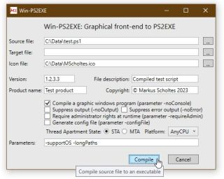
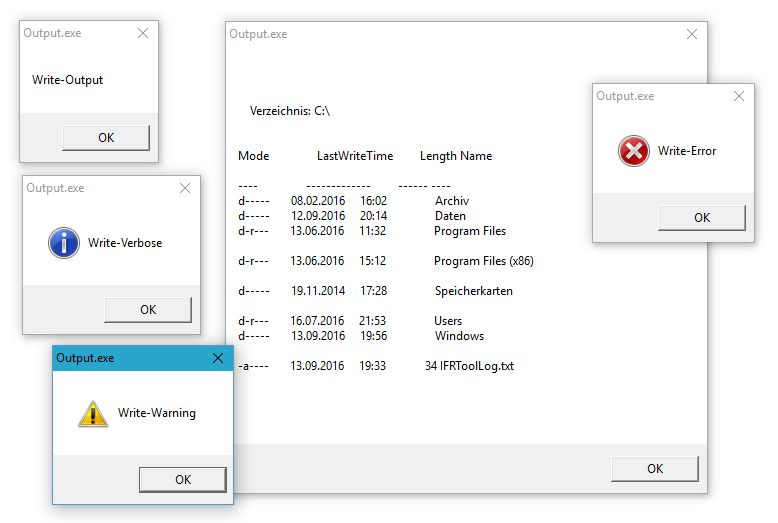

# PS2EXE-GUI: "Convert" PowerShell Scripts to EXE Files with GUI
Overworking of the great script of Ingo Karstein with GUI support. The GUI output and input is activated with one switch, real windows executables are generated. With Powershell 5.x support and graphical front end.

Since Technet Gallery is closed, now here.

Script Center version was here, but now offline: [PS2EXE-GUI: "Convert" PowerShell Scripts to EXE Files with GUI](https://gallery.technet.microsoft.com/PS2EXE-GUI-Convert-e7cb69d5).

### Author: Markus Scholtes

### Version: v0.5.0.33

### Date: 2025-08-21

All of you know the fabulous script PS2EXE by Ingo Karstein you could download here: [PS2EXE : "Convert" PowerShell Scripts to EXE Files](https://gallery.technet.microsoft.com/scriptcenter/PS2EXE-Convert-PowerShell-9e4e07f1).

Unfortunately Ingo seems to have stopped working on his script so I overworked his script with some error fixes, improvements and output support for non-console WinForms scripts (parameter -noConsole to ps2exe.ps1).


Module based version available now on Powershell Gallery, see here (https://www.powershellgallery.com/packages/ps2exe) or install with
```powershell
Install-Module PS2EXE
```

Project page on github is [here](https://github.com/MScholtes/PS2EXE).


### Update v0.5.0.33 - 2025-08-21
- new parameter -embedFiles to embed files in compiled executable

Full list of changes and fixes in [Changes.txt](Changes.txt).


### Includes Win-PS2EXE, a small graphical front end for PS2EXE.

Not all parameters are supported, requires .Net 4.x. C# WPF application. With drag'n'drop for file names. Has to be placed in the same directory as ps2exe.ps1. Source code and .Net 3.5 version are here: (https://github.com/MScholtes/Win-PS2EXE).




## GUI support:

- expanded every output and input function like Write-Host, Write-Output, Write-Error, Out-Default, Prompt, ReadLine to use WinForms message boxes or input boxes automatically when compiling a GUI application

- no console windows appears, real windows executables are generated

- just compile with switch "-noConsole" for this feature (i.e. .\ps2exe.ps1 .\output.ps1 -noConsole)

- see remarks below for formatting of output in GUI mode



## Examples:
Compile all of the examples in the Examples sub directory with

```powershell
BuildExamples.bat
```

Every script will be compiled to a console and a GUI version (-NoConsole).


## Remarks:

### Use of Powershell Core:
PS2EXE can be used with Powershell Core. But since .Net Core is not delivered with a compiler, the compiler of .Net Framework is used (.Net Framework and Powershell 5.1 are included in Windows).

**For this reason PS2EXE can only compile Powershell 5.1 compatible scripts and generates .Net 4.x binaries, but can still be used directly on every supported Windows OS without dependencies.**

### Embedding files in compiled executables:
With the parameter *-embedFiles* followed by a hash table with paths to files those files will be embedded in the compiled executable.
At startup of the executable those files will be written to disk to the specified paths, e.g. *-embedFiles @{'Targetfilepath1'='Sourcefilepath1';'Targetfilepath2'='Sourcefilepath2'}*.
Source file names must be unique. Absolute and relative paths are allowed. For target paths a relative path beginning with *'.\\'* is interpreted as relative to the executable, without the leading *'.\\'* as relative to the current path at runtime.
Directories are created automaticly on startup if necessary. In the target path environment variables in cmd.exe notation like *%TEMP%* or *%APPDATA%* are expanded at runtime.
A failure in creating one of the embedded files will stop the execution of the compiled executable immediately.

### List of cmdlets not implemented:
The basic input/output commands had to be rewritten in C# for PS2EXE. Not implemented are *Write-Progress* in console mode (too much work) and *Start-Transcript*/*Stop-Transcript* (no proper reference implementation by Microsoft).

### GUI mode output formatting:
By default output of commands are formatted line per line (as an array of strings). When your command generates 10 lines of output and you use GUI output, 10 message boxes will appear each awaitung for an OK. To prevent this pipe your command to the comandlet Out-String. This will convert the output to a string array with 10 lines, all output will be shown in one message box (for example: dir C:\ | Out-String).

### Parameter processing:
Compiled scripts process parameters like the original script does. One restriction comes from the Windows environment: for all executables all parameters have the type STRING, if there is no implicit conversion for your parameter type you have to convert explicitly in your script. You can even pipe content to the executable with the same restriction (all piped values have the type STRING).

A generated executable has the following reserved parameters:
```
-? [<MODIFIER>] Powershell help text of the script inside the executable. The optional parameter combination "-? -detailed",
  "-? -examples" or "-? -full" can be used to get the appropriate help text.
-debug Forces the executable to be debugged. It calls "System.Diagnostics.Debugger.Launch()".
-extract:<FILENAME> Extracts the powerShell script inside the executable and saves it as FILENAME. The script will not be executed.
-wait At the end of the script execution it writes "Hit any key to exit..." and waits for a key to be pressed.
-end All following options will be passed to the script inside the executable. All preceding options are used by the executable itself.
```

### Password security:
Never store passwords in your compiled script! One can simply decompile the script with the parameter -extract. For example
```powershell
Output.exe -extract:C:\Output.ps1
```
will decompile the script stored in Output.exe.

### Script variables:
Since PS2EXE converts a script to an executable, script related variables are not available anymore. Especially the variable $PSScriptRoot is empty.

The variable $MyInvocation is set to other values than in a script.

You can retrieve the script/executable path independant of compiled/not compiled with the following code (thanks to JacquesFS):

```powershell
if ($MyInvocation.MyCommand.CommandType -eq "ExternalScript")
{ $ScriptPath = Split-Path -Parent -Path $MyInvocation.MyCommand.Definition }
else
{ $ScriptPath = Split-Path -Parent -Path ([Environment]::GetCommandLineArgs()[0])
	if (!$ScriptPath){ $ScriptPath = "." } }
```

### Window in background in -noConsole mode:
When an external window is opened in a script with -noConsole mode (i.e. for Get-Credential or for a command that needs a cmd.exe shell) the next window is opened in the background.

The reason for this is that on closing the external window windows tries to activate the parent window. Since the compiled script has no window, the parent window of the compiled script is activated instead, normally the window of Explorer or Powershell.

To work around this, $Host.UI.RawUI.FlushInputBuffer() opens an invisible window that can be activated. The following call of $Host.UI.RawUI.FlushInputBuffer() closes this window (and so on).

The following example will not open a window in the background anymore as a single call of "ipconfig | Out-String" will do:

```powershell
	$Host.UI.RawUI.FlushInputBuffer()
	ipconfig | Out-String
	$Host.UI.RawUI.FlushInputBuffer()
```
