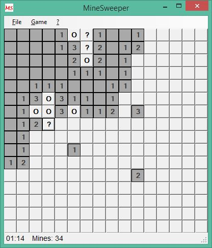

# Powershell MineSweeper
Powershell game of MineSweeper with WinForms graphics. Based on the game of /\/\o\/\/.

Since Technet Gallery will be closed, now here.

See Script Center version: [Powershell MineSweeper](https://gallery.technet.microsoft.com/Powershell-MineSweeper-f755188f).

## Description
Do you remember the good old days of Monad and MSH?

In those days there was a great blog by /\/\o\/\/, his scripts and technics were stunning. I liked to play his powershell version of MineSweeper, one of my entry points to WinForms scripting.

Those days I found his script on my hard drive, overworked it (and eliminated one big error: the accidental permutation of rows and columns in a computation) and added some additional WinForms features like status bar, timer, shortcuts, icon ... 

See it as a graphical scripting example.

Maybe someone will program keyboard control, some graphics or a WPF version?



The blog of /\/\o\/\/ is still working, but there have been no additions for several years: (http://mow001.blogspot.de/2005/11/msh-minesweeper-gui-game.html). He later moved to **ThePowershellGuy**.

Just start the game with

```powershell
.\MineSweeper.ps1
```
(assuming MineSweeper.ps1 is in the current directory)

Mark a field as free with left mouse click.

Mark a field as bomb with right mouse click. The second right click sets a question mark, the third unmarks.

Have fun!!!