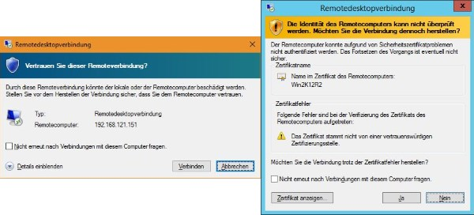
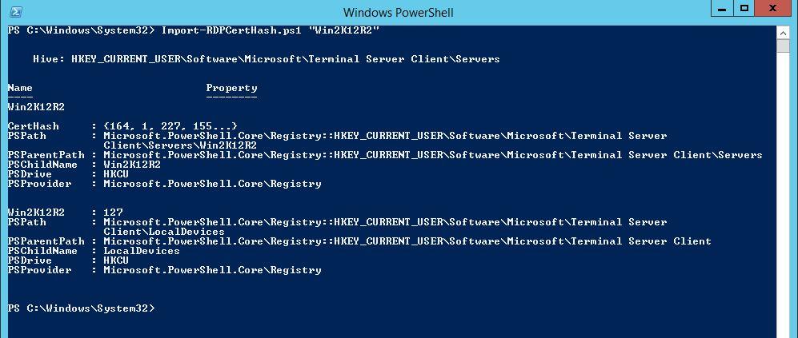

# Script to manually import RDP certificates
Script to import the registry keys and certificate thumbnails for unknown RDP connections. No RDP trust warnings will appear for the remote machine after running the script.

Since Technet Gallery is closed, now here.

See Script Center version: [Script to manually import RDP certificates](https://gallery.technet.microsoft.com/Script-to-manually-load-31a1e76d).

## Description
Are you working in a windows server environment with no PKI (for all systems)? 

Then you know the annoying certificate trust questions when you connect to a server with RDP the first time. You can disable this for your RDP client with the registry key AuthenticationLevelOverride, but this is a security risk.

The powershell script **Import-RDPCertHash.ps1** connect to the network port 3389 (this is the RDP port) of a given remote machine, reads the certificate and writes the thumbnail of the certificate to the registry. Additionally it sets the registry values that the "unknown publisher warning" will never appear again for this machine. No trust warnings for this connection will pop up anymore!

Warnings for untrusted RDP connections (sorry, screenshots only in german):



## Example
(assuming the script Import-RDPCertHash.ps1 is in the current directory)

```powershell
.\Import-RDPCertHash.ps1 "Win2K12R2"
```

This will add the entries for the server with the name "Win2K12R2" to the registry:



## Remarks
* Main work of this script is done by the great function **Get-PortCertificate** by [Caleb Keene](https://social.technet.microsoft.com/profile/caleb%20keene/), a big thank you! 

Please look at his script here: [Get the SSL certificate from a listening TLS/SSL service port](https://gallery.technet.microsoft.com/scriptcenter/Get-the-SSL-certificate-02fea13d).

* Use with caution

Only accept certificates from machines you trust!
