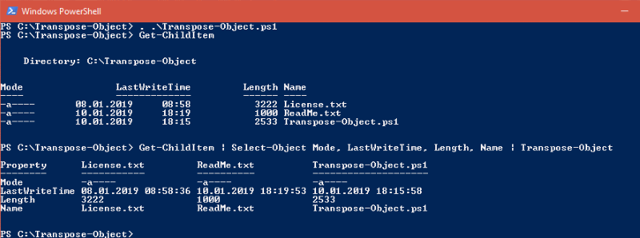
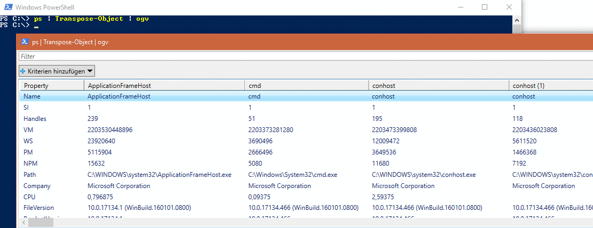

# Transpose-Object: Powershell script to transpose objects from columns to rows
Useful when the order displayed in a GridView (with Out-GridView) or in a CSV file (with Export-Csv) has to be rotated.

Since Technet Gallery is closed, now here.

See Script Center version: [Transpose-Object: Powershell script to transpose objects from columns to rows](https://gallery.technet.microsoft.com/Transpose-Object-cf517eb5).

## Description
Transpose-Object: Powershell script to transpose objects from columns to rows. Useful when the order displayed in a GridView (with Out-GridView) or in a CSV file (with Export-Csv) has to be rotated.

The function Transpose-Object works on an object passed to it through the pipeline and flips propertys of the object.
It uses the name property as new property names (column headers) if it exists.

The information about the default view gets lost since new objects are created, you may have to place an limiting select statement before (see example below).

## Examples
assuming Transpose-Object.ps1 is in the current directory

Show directory listing with a column instead of a row for every file/directory:
```powershell
. .\Transpose-Object.ps1
dir | Transpose-Object | Out-GridView
```



Create a CSV file with a column instead of a row for every process:
```powershell
. .\Transpose-Object.ps1
ps | Transpose-Object | Export-Csv Processes.csv -Delimiter ';' -NoTypeInformation
```



Use and transpose only the default view properties:
```powershell
. .\Transpose-Object.ps1
Get-ChildItem | Select-Object Mode, LastWriteTime, Length, Name | Transpose-Object
```
