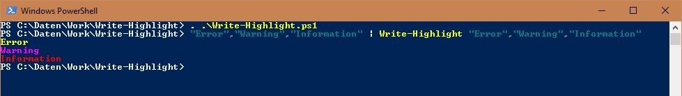

# Write-Highlight: Highlighting of multiple search patterns in different colors
Powershell script that highlights multiple search patterns in the output. You can give an array of regular expressions, every expression is marked in its own color.

Since Technet Gallery is closed, now here.

See Script Center version: [Write-Highlight: Highlighting of multiple search patterns in different colors](https://gallery.technet.microsoft.com/Write-Highlight-Highlightin-4884d23b).

## Description
Powershell script that highlights multiple search patterns in the output. You can give an array of regular expressions, every expression is marked in its own color.

I used this programming task to implement a ring buffer with a queue, clone the input pipeline, hand a variable of object type to a function per reference and save many programming lines by using recursion (no one seems to use recursion anymore). Just to see that it works and as a snippet container for me.



To use the function Write-Highlight, you have to dot source the function first, e.g. with:
(assuming the script is in the current directory)
```powershell
. .\Write-Highlight.ps1
```

## Examples
Display the current directory and highlights all files that have a .ps1 or .bat extension.
```powershell
Get-ChildItem | Write-Highlight "\w+\.ps1","\w+\.bat"
```

Display the current directory and highlights all files that have a .ps1 extension.

The complete directory listing is handed to the commandlet Sort afterwards.
```powershell
Get-ChildItem | Write-Highlight "\w+\.ps1" -PassThru | Sort -Property Length
```

Every number in the output is highlighted with its own color.
```powershell
1..10 | %{ "Line $_" } | Write-Highlight -Pattern "1","2","3","4","5","6","7","8","9","10"
```

All lines in the file "Write-Highlight.ps1" with the case sensitive expression "STRING" are given out, the expression "STRING" is highligthed.
```powershell
gc .\Write-Highlight.ps1 | Write-Highlight "STRING" -Case -OnlyMatches
```
